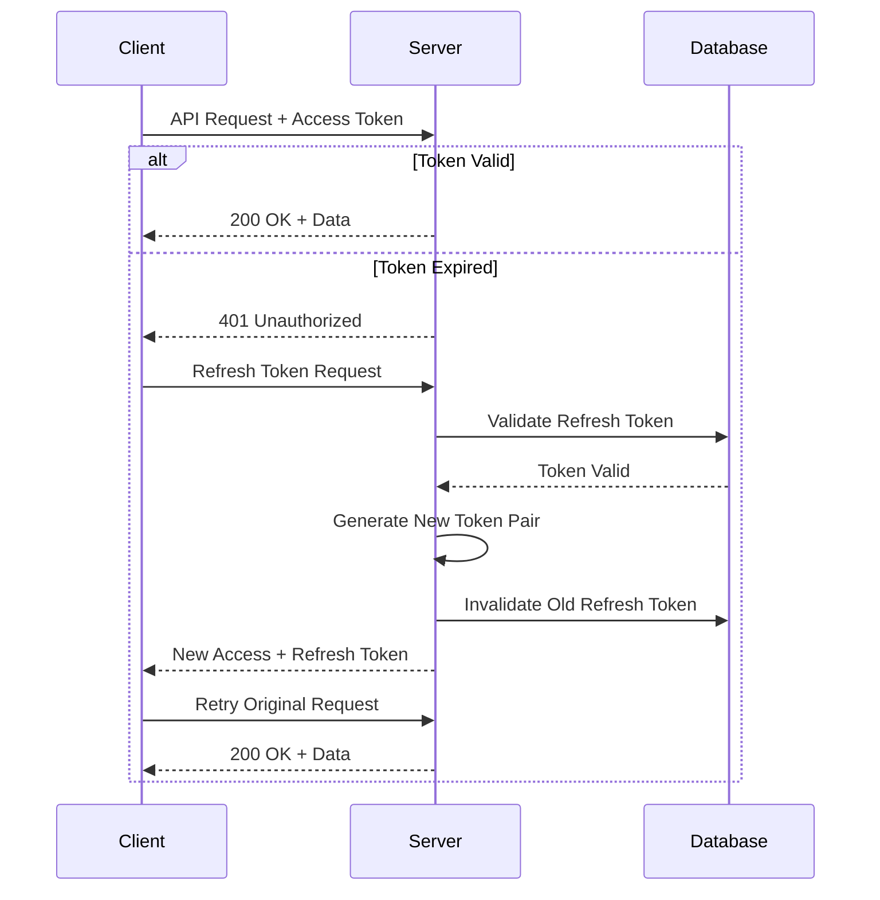

# 🔒 YanYu Cloud³ 安全实施指南

> **文档版本**: v2.0 | **最后更新**: 2026-05-01 | **安全评级**: A+

---

## 📋 目录

1. [安全架构概览](#1-安全架构概览)
2. [多层防护策略](#2-多层防护策略)
3. [JWT增强安全机制](#3-jwt增强安全机制)
4. [认证与授权](#4-认证与授权)
5. [数据保护](#5-数据保护)
6. [API安全](#6-api安全)
7. [基础设施安全](#7-基础设施安全)
8. [安全最佳实践](#8-安全最佳实践)
9. [漏洞报告流程](#9-漏洞报告流程)

---

## 1. 安全架构概览

### 安全设计原则

YanYu Cloud³ 采用**纵深防御**策略，实现多层次安全保护：

```
┌─────────────────────────────────────┐
│ 应用层安全 (HTTPS, CSP, CORS)        │ ← 第1层: 网络与应用
├─────────────────────────────────────┤
│ 认证授权 (JWT, RBAC, MFA)            │ ← 第2层: 身份验证
├─────────────────────────────────────┤
│ API安全 (签名, 限流, 加密)             │ ← 第3层: 接口保护
├─────────────────────────────────────┤
│ 数据安全 (加密存储, 传输加密)            │ ← 第4层: 数据保护
├─────────────────────────────────────┤
│ 基础设施 (防火墙, DDoS防护)            │ ← 第5层: 基础设施
└─────────────────────────────────────┘
```

---

## 2. 多层防护策略

### 2.1 应用层安全

#### HTTPS 强制使用
```typescript
// 生产环境强制 HTTPS
if (process.env.NODE_ENV === 'production') {
  app.use((req, res, next) => {
    if (req.protocol === 'https' || req.secure) {
      next();
    } else {
      res.redirect(301, `https://${req.headers.host}${req.url}`);
    }
  });
}
```

#### Content Security Policy (CSP)
```javascript
// Helmet CSP 配置
app.use(helmet({
  contentSecurityPolicy: {
    directives: {
      defaultSrc: ["'self'"],
      styleSrc: ["'self'", "'unsafe-inline'"],
      scriptSrc: ["'self'"],
      fontSrc: ["'self'", "data:"],
      imgSrc: ["'self'", "data:", "https:"],
    },
  },
}));
```

#### CORS 配置
```typescript
app.use(cors({
  origin: process.env.CORS_ORIGIN || 'http://localhost:3000',
  methods: ['GET', 'POST', 'PUT', 'DELETE', 'PATCH', 'OPTIONS'],
  allowedHeaders: ['Content-Type', 'Authorization'],
  credentials: true,
  maxAge: 86400, // 24小时预检缓存
}));
```

---

## 3. JWT 增强安全机制

### 3.1 Token 结构

**Access Token (短期 - 15分钟)**:
```typescript
interface AccessTokenPayload {
  sub: string;           // 用户ID
  email: string;         // 用户邮箱
  role: string;          // 角色
  permissions: string[]; // 权限列表
  deviceId: string;      // 设备指纹
  iat: number;           // 签发时间
  exp: number;           // 过期时间
  type: 'access';        // Token类型
}
```

**Refresh Token (长期 - 7天)**:
```typescript
interface RefreshTokenPayload {
  sub: string;        // 用户ID
  tokenId: string;    // 唯一Token ID（用于撤销）
  iat: number;        // 签发时间
  exp: number;        // 过期时间
  type: 'refresh';    // Token类型
}
```

### 3.2 Token 刷新流程



### 3.3 Token 存储安全

| 存储方式 | Access Token | Refresh Token |
|---------|-------------|---------------|
| 内存 (推荐) | ✅ | ❌ |
| HttpOnly Cookie | ✅ | ✅ |
| LocalStorage | ⚠️ XSS风险 | ❌ |
| SessionStorage | ⚠️ XSS风险 | ❌ |

---

## 4. 认证与授权

### 4.1 密码安全

```typescript
import bcrypt from 'bcrypt';

const SALT_ROUNDS = 12;

// 密码哈希
const hashPassword = async (password: string): Promise<string> => {
  return bcrypt.hash(password, SALT_ROUNDS);
};

// 密码验证
const verifyPassword = async (
  password: string, 
  hash: string
): Promise<boolean> => {
  return bcrypt.compare(password, hash);
};
```

### 4.2 RBAC 权限控制

```typescript
// 角色定义
enum UserRole {
  ADMIN = 'admin',
  MANAGER = 'manager',
  USER = 'user',
  GUEST = 'guest'
}

// 权限矩阵
const ROLE_PERMISSIONS: Record<UserRole, string[]> = {
  admin: ['*'], // 全部权限
  manager: [
    'ticket:read', 'ticket:write', 'ticket:delete',
    'reconciliation:read', 'reconciliation:write',
    'user:read'
  ],
  user: [
    'ticket:read', 'ticket:write',
    'reconciliation:read'
  ],
  guest: [
    'ticket:read'
  ]
};
```

### 4.3 中间件实现

```typescript
// 认证中间件
export const authenticate = async (
  req: AuthenticatedRequest,
  res: Response,
  next: NextFunction
): Promise<void> => {
  try {
    const token = extractBearerToken(req.headers.authorization);
    
    if (!token) {
      throw new AppError(ErrorCode.UNAUTHORIZED, 'Missing authentication token');
    }

    const payload = await verifyAccessToken(token);
    req.user = payload;
    next();
  } catch (error) {
    next(error);
  }
};

// 授权中间件
export const authorize = (...permissions: string[]) => {
  return (req: AuthenticatedRequest, res: Response, next: NextFunction): void => {
    const userPermissions = req.user?.permissions || [];
    
    const hasPermission = permissions.some(
      perm => userPermissions.includes(perm) || userPermissions.includes('*')
    );

    if (!hasPermission) {
      throw new AppError(ErrorCode.FORBIDDEN, 'Insufficient permissions');
    }
    
    next();
  };
};
```

---

## 5. 数据保护

### 5.1 敏感数据加密

```typescript
import crypto from 'crypto';

const ALGORITHM = 'aes-256-gcm';
const KEY_LENGTH = 32;
const IV_LENGTH = 16;
const TAG_LENGTH = 16;

// 加密敏感字段
const encryptField = (plaintext: string, key: string): string => {
  const iv = crypto.randomBytes(IV_LENGTH);
  const cipher = crypto.createCipheriv(ALGORITHM, Buffer.from(key), iv);
  
  let encrypted = cipher.update(plaintext, 'utf8', 'hex');
  encrypted += cipher.final('hex');
  
  const tag = cipher.getAuthTag();
  
  return `${iv.toString('hex')}:${tag.toString('hex')}:${encrypted}`;
};

// 解密
const decryptField = (encryptedData: string, key: string): string => {
  const [ivHex, tagHex, encrypted] = encryptedData.split(':');
  
  const decipher = crypto.createDecipheriv(
    ALGORITHM, 
    Buffer.from(key), 
    Buffer.from(ivHex, 'hex')
  );
  
  decipher.setAuthTag(Buffer.from(tagHex, 'hex'));
  
  let decrypted = decipher.update(encrypted, 'hex', 'utf8');
  decrypted += decipher.final('utf8');
  
  return decrypted;
};
```

### 5.2 数据库安全

```sql
-- 启用行级安全策略 (RLS)
ALTER TABLE tickets ENABLE ROW LEVEL SECURITY;

-- 创建策略：用户只能查看自己的工单
CREATE POLICY user_tickets ON tickets
  FOR ALL
  USING (created_by = current_user);

-- 加密敏感列
ALTER TABLE users ADD COLUMN encrypted_ssn text;

-- 创建触发器自动加密
CREATE OR REPLACE FUNCTION encrypt_sensitive_data()
RETURNS TRIGGER AS $$
BEGIN
  NEW.encrypted_ssn = pgp_symmetric_encrypt(
    NEW.ssn,
    current_setting('app.encryption_key')
  );
  NEW.ssn = NULL; -- 清除明文
  RETURN NEW;
END;
$$ LANGUAGE plpgsql;
```

---

## 6. API 安全

### 6.1 速率限制

```typescript
import rateLimit from 'express-rate-limit';

// 全局限流
const globalLimiter = rateLimit({
  windowMs: 15 * 60 * 1000, // 15分钟
  max: 100,                 // 每IP 100次请求
  standardHeaders: true,
  legacyHeaders: false,
  message: {
    error: 'Too many requests, please try again later.',
    retryAfter: Math.ceil(15 * 60 * 1000 / 1000),
  },
});

// 认证接口更严格限制
const authLimiter = rateLimit({
  windowMs: 15 * 60 * 1000,
  max: 5,                  // 登录接口每15分钟5次
  message: { error: 'Too many login attempts' },
});
```

### 6.2 输入验证

```typescript
import { body, validationResult } from 'express-validator';

// 工单创建验证规则
const createTicketValidation = [
  body('title')
    .trim()
    .isLength({ min: 3, max: 200 })
    .withMessage('Title must be 3-200 characters')
    .escape(),
  
  body('description')
    .optional()
    .trim()
    .isLength({ max: 5000 })
    .withMessage('Description too long')
    .sanitizeHtml(), // 防止XSS
  
  body('priority')
    .isIn(['low', 'medium', 'high', 'critical'])
    .withMessage('Invalid priority'),
  
  (req: Request, res: Response, next: NextFunction) => {
    const errors = validationResult(req);
    if (!errors.isEmpty()) {
      throw new AppError(
        ErrorCode.VALIDATION_ERROR, 
        'Validation failed',
        errors.array()
      );
    }
    next();
  },
];
```

### 6.3 SQL 注入防护

```typescript
// ✅ 正确：使用参数化查询
const getUserById = async (userId: string) => {
  const result = await pool.query(
    'SELECT * FROM users WHERE id = $1',
    [userId] // 参数化，防止SQL注入
  );
  return result.rows[0];
};

// ❌ 错误：字符串拼接（危险！）
// const query = `SELECT * FROM users WHERE id = '${userId}'`;
```

---

## 7. 基础设施安全

### 7.1 Docker 安全

```dockerfile
# 使用非root用户运行
FROM node:20-alpine

# 创建专用用户
RUN addgroup -S appgroup && adduser -S appuser -G appgroup

USER appuser

# 只读文件系统
VOLUME ["/app/tmp"]

# 移除不必要的工具
RUN apk del --purge \
    git \
    curl \
    wget
```

### 7.2 日志安全

```typescript
// 不要记录敏感信息
const sanitizeLogData = (data: Record<string, unknown>): Record<string, unknown> => {
  const sensitiveFields = [
    'password', 
    'token', 
    'apiKey', 
    'secret',
    'creditCard',
    'ssn'
  ];
  
  const sanitized = { ...data };
  
  for (const field of sensitiveFields) {
    if (sanitized[field]) {
      sanitized[field] = '[REDACTED]';
    }
  }
  
  return sanitized;
};
```

---

## 8. 安全最佳实践

### ✅ 必须遵守

1. **最小权限原则**
   - 数据库用户仅授予必要权限
   - API Token 限制作用域和有效期
   - 文件系统只读访问

2. **定期安全审计**
   ```bash
   # 每周运行安全扫描
   npm audit --production
   
   # 依赖漏洞检查
   npm outdated
   ```

3. **安全响应计划**
   - 建立 24/7 安全监控
   - 制定应急响应流程
   - 定期演练安全事件处理

### ❌ 绝对禁止

1. **硬编码密钥或密码**
2. **在日志中输出敏感信息**
3. **禁用生产环境的安全头**
4. **使用 `eval()` 或类似危险函数**
5. **忽略依赖安全警告**

---

## 9. 漏洞报告流程

### 如何报告安全漏洞

请通过以下方式报告安全漏洞：

1. **首选方式**: 发送电子邮件至 [security@yanyucloud.com](mailto:security@yanyucloud.com)
2. 请在主题中包含「**安全漏洞报告 - YanYu Cloud³**」

### 报告内容要求

为了帮助我们快速解决问题，请在报告中包含：

- ✅ 漏洞的详细描述
- ✅ 复现漏洞的步骤（PoC）
- ✅ 受影响的组件和版本号
- ✅ 可能的影响范围和严重程度评估
- ✅ 如有可能，提供修复建议

### 响应时间承诺

| 阶段 | 时间框架 | 说明 |
|------|---------|------|
| 确认收到 | 24小时内 | 确认报告已收到 |
| 初步评估 | 72小时内 | 提供初步严重性评估 |
| 进度更新 | 每周至少一次 | 更新修复进展 |
| 修复发布 | 根据严重程度 | 发布安全补丁 |
| 公开披露 | 修复后90天 | 发布安全公告 |

### 奖励计划

我们认可安全研究者的贡献：

- 🔴 **Critical**: $2,000 - $10,000
- 🟠 **High**: $1,000 - $5,000
- 🟡 **Medium**: $500 - $2,000
- 🟢 **Low**: $100 - $500
- ⚪ **Informational**: 荣誉证书 + 致谢

---

## 📊 安全检查清单

部署前必须完成以下检查：

- [ ] 所有环境变量已从代码中移除
- [ ] JWT 密钥强度 >= 256位
- [ ] HTTPS 已启用且配置正确
- [ ] CSP 头已配置
- [ ] 速率限制已启用
- [ ] 输入验证已实施
- [ ] SQL 注入防护已到位
- [ ] XSS 防护已启用
- [ ] CSRF 保护已配置
- [ ] 日志中无敏感信息
- [ ] 依赖项已更新到最新安全版本
- [ ] 数据库备份已加密

---

## 🎯 安全实施最佳实践案例 (2026-05-03 更新)

### 案例 1: 完整的认证流程实现

#### 场景：用户登录 + Token 刷新 + 多设备管理

```typescript
// backend/src/services/auth.service.ts
import jwt from 'jsonwebtoken';
import bcrypt from 'bcrypt';
import crypto from 'crypto';

class AuthService {
  // 登录认证
  async login(email: string, password: string, ipAddress: string) {
    // 1. 查找用户
    const user = await this.userRepo.findByEmail(email);
    if (!user) {
      // 防止用户枚举攻击 - 统一响应时间
      await bcrypt.compare(password, '$2b$12$dummyhash');
      throw new UnauthorizedError('Invalid credentials');
    }

    // 2. 验证密码
    const isValid = await bcrypt.compare(password, user.passwordHash);
    if (!isValid) {
      // 记录失败尝试
      await this.recordFailedAttempt(user.id, ipAddress);
      throw new UnauthorizedError('Invalid credentials');
    }

    // 3. 检查账户锁定状态
    if (user.isLocked) {
      throw new LockedError('Account temporarily locked');
    }

    // 4. 生成 Token 对
    const tokens = await this.generateTokenPair(user);

    // 5. 记录登录日志（不含敏感信息）
    await this.logAuthEvent({
      userId: user.id,
      event: 'LOGIN_SUCCESS',
      ipAddress,
      userAgent: this.sanitizeUserAgent(req.headers['user-agent']),
    });

    return { user: this.sanitizeUser(user), ...tokens };
  }

  // 生成安全的 Token 对
  private async generateTokenPair(user: User) {
    const tokenId = crypto.randomUUID();
    
    // Access Token - 短期 (15分钟)
    const accessToken = jwt.sign(
      {
        sub: user.id,
        email: user.email,
        role: user.role,
        permissions: user.permissions,
        type: 'access',
        tokenId,
      },
      process.env.JWT_SECRET!,
      { 
        expiresIn: '15m',
        algorithm: 'HS256', // 明确指定算法
        issuer: 'yyc3-api',
        audience: 'yyc3-client',
      }
    );

    // Refresh Token - 长期 (7天)，存储在数据库
    const refreshToken = crypto.randomBytes(64).toString('hex');
    
    await this.tokenStore.create({
      tokenId,
      tokenHash: await bcrypt.hash(refreshToken, 12),
      userId: user.id,
      expiresAt: new Date(Date.now() + 7 * 24 * 60 * 60 * 1000),
      ipAddress,
      deviceInfo: this.extractDeviceInfo(req.headers['user-agent']),
    });

    return { accessToken, refreshToken };
  }
}
```

#### 关键安全点：

1. **防用户枚举**: 即使不存在用户也执行 bcrypt 比较
2. **账户锁定**: 多次失败后临时锁定
3. **Token ID**: 用于撤销和追踪
4. **Refresh Token 哈希存储**: 即使数据库泄露也无法使用
5. **明确算法**: 防止算法混淆攻击
6. **审计日志**: 记录所有认证事件

---

### 案例 2: API 请求安全中间件链

#### 场景：完整的请求处理安全链

```typescript
// backend/src/middleware/security.chain.ts
import helmet from 'helmet';
import rateLimit from 'express-rate-limit';
import cors from 'cors';
import { Request, Response, NextFunction } from 'express';

export const securityMiddlewareChain = [
  // 1. Helmet - 安全头设置
  helmet({
    contentSecurityPolicy: {
      directives: {
        defaultSrc: ["'self'"],
        styleSrc: ["'self'", "'unsafe-inline'", "fonts.googleapis.com"],
        scriptSrc: ["'self'"],
        fontSrc: ["'self'", "fonts.gstatic.com", "data:"],
        imgSrc: ["'self'", "data:", "https:"],
        connectSrc: ["'self'", "https://api.openai.com"],
      },
    },
    hsts: {
      maxAge: 31536000, // 1年
      includeSubDomains: true,
      preload: true,
    },
    noSniff: true,
    xssFilter: true,
  }),

  // 2. CORS 配置
  cors({
    origin: (origin, callback) => {
      const allowedOrigins = (
        process.env.CORS_ORIGINS || 'http://localhost:3000'
      ).split(',');
      
      if (!origin || allowedOrigins.includes(origin)) {
        callback(null, true);
      } else {
        callback(new Error('Not allowed by CORS'));
      }
    },
    methods: ['GET', 'POST', 'PUT', 'DELETE', 'PATCH', 'OPTIONS'],
    allowedHeaders: [
      'Content-Type', 
      'Authorization',
      'X-Requested-With',
      'X-CSRF-Token',
    ],
    credentials: true,
    maxAge: 86400,
    optionsSuccessStatus: 204,
  }),

  // 3. 全局速率限制
  rateLimit({
    windowMs: 15 * 60 * 1000, // 15分钟
    max: 100, // 每IP 100次
    standardHeaders: true,
    legacyHeaders: false,
    keyGenerator: (req) => {
      // 使用 IP + API Key 组合作为限流键
      const ip = req.ip || req.connection.remoteAddress;
      const apiKey = req.headers['x-api-key'];
      return `${ip}:${apiKey || 'anonymous'}`;
    },
    handler: (req, res) => {
      res.status(429).json({
        error: 'Too many requests',
        retryAfter: Math.ceil(15 * 60 * 1000 / 1000),
        message: 'Rate limit exceeded. Please try again later.',
      });
    },
  }),

  // 4. 请求体大小限制
  (req: Request, res: Response, next: NextFunction) => {
    if (req.method === 'POST' || req.method === 'PUT') {
      const contentLength = parseInt(req.headers['content-length'] || '0', 10);
      const maxSize = 10 * 1024 * 1024; // 10MB
      
      if (contentLength > maxSize) {
        return res.status(413).json({ error: 'Request entity too large' });
      }
    }
    next();
  },

  // 5. 移除敏感响应头
  (req: Request, res: Response, next: NextFunction) => {
    res.removeHeader('X-Powered-By');
    next();
  },
];
```

---

### 案例 3: 敏感数据加密工具类

```typescript
// backend/src/utils/encryption.utils.ts
import crypto from 'crypto';

export class EncryptionUtils {
  private static readonly ALGORITHM = 'aes-256-gcm';
  private static readonly KEY_LENGTH = 32;
  private static readonly IV_LENGTH = 16;
  private static readonly TAG_LENGTH = 16;

  /**
   * 加密敏感字段（如身份证号、银行卡号）
   */
  static encrypt(plaintext: string): string {
    const key = this.getEncryptionKey();
    const iv = crypto.randomBytes(this.IV_LENGTH);
    const cipher = crypto.createCipheriv(
      this.ALGORITHM, 
      Buffer.from(key, 'hex'), 
      iv
    );

    let encrypted = cipher.update(plaintext, 'utf8', 'hex');
    encrypted += cipher.final('hex');

    const tag = cipher.getAuthTag();

    // 格式: iv:tag:ciphertext
    return [
      iv.toString('hex'),
      tag.toString('hex'),
      encrypted,
    ].join(':');
  }

  /**
   * 解密敏感字段
   */
  static decrypt(encryptedData: string): string {
    const key = this.getEncryptionKey();
    const [ivHex, tagHex, encrypted] = encryptedData.split(':');

    if (!ivHex || !tagHex || !encrypted) {
      throw new Error('Invalid encrypted data format');
    }

    try {
      const decipher = crypto.createDecipheriv(
        this.ALGORITHM,
        Buffer.from(key, 'hex'),
        Buffer.from(ivHex, 'hex')
      );

      decipher.setAuthTag(Buffer.from(tagHex, 'hex'));

      let decrypted = decipher.update(encrypted, 'hex', 'utf8');
      decrypted += decipher.final('utf8');

      return decrypted;
    } catch (error) {
      throw new Error('Decryption failed: possibly tampered data');
    }
  }

  /**
   * 生成数据脱敏版本（用于日志）
   */
  static maskSensitiveData(data: string, visibleChars: number = 4): string {
    if (!data || data.length <= visibleChars) {
      return '****';
    }
    
    return data.slice(0, visibleChars) + '*'.repeat(data.length - visibleChars);
  }

  /**
   * 获取加密密钥（从环境变量或密钥管理服务）
   */
  private static getEncryptionKey(): string {
    const key = process.env.ENCRYPTION_KEY;
    
    if (!key || key.length !== this.KEY_LENGTH * 2) { // hex编码需要64字符
      throw new Error('Invalid or missing ENCRYPTION_KEY environment variable');
    }
    
    return key;
  }
}

// 使用示例
const ssn = EncryptionUtils.encrypt('110101199001011234'); // 加密存储
const masked = EncryptionUtils.maskSensitiveData(ssn);     // 日志输出: 1101**********
```

---

### 案例 4: 安全的文件上传处理

```typescript
// backend/src/services/upload.service.ts
import path from 'path';
import fs from 'fs/promises';
import { pipeline } from 'stream/promises';
import crypto from 'crypto';

class UploadService {
  
  async uploadFile(file: Express.Multer.File, userId: string) {
    // 1. 文件类型白名单验证
    const ALLOWED_TYPES = new Set([
      'image/jpeg',
      'image/png',
      'image/gif',
      'application/pdf',
      'application/msword',
      'application/vnd.openxmlformats-officedocument.wordprocessingml.document',
    ]);

    if (!ALLOWED_TYPES.has(file.mimetype)) {
      throw new ValidationError(`File type ${file.mimetype} not allowed`);
    }

    // 2. 文件大小检查 (10MB)
    const MAX_SIZE = 10 * 1024 * 1024;
    if (file.size > MAX_SIZE) {
      throw new ValidationError('File size exceeds limit of 10MB');
    }

    // 3. 生成安全的文件名（避免路径遍历攻击）
    const fileExtension = path.extname(file.originalname).toLowerCase();
    const safeFileName = `${crypto.randomUUID()}${fileExtension}`;

    // 4. 验证文件扩展名与 MIME 类型匹配
    const EXTENSION_MIME_MAP: Record<string, string> = {
      '.jpg': 'image/jpeg',
      '.jpeg': 'image/jpeg',
      '.png': 'image/png',
      '.gif': 'image/gif',
      '.pdf': 'application/pdf',
    };

    if (EXTENSION_MIME_MAP[fileExtension] !== file.mimetype) {
      throw new SecurityError('File extension does not match content type');
    }

    // 5. 文件内容扫描（可选：集成病毒扫描）
    await this.scanFileContent(file.path);

    // 6. 存储文件（使用随机路径）
    const datePath = new Date().toISOString().slice(0, 10).replace(/-/g, '/');
    const relativePath = `uploads/${datePath}/${safeFileName}`;
    const fullPath = path.join(process.cwd(), relativePath);

    // 确保目录存在
    await fs.mkdir(path.dirname(fullPath), { recursive: true });

    // 移动文件到安全位置
    await fs.rename(file.path, fullPath);

    // 设置文件权限（仅所有者可读写）
    await fs.chmod(fullPath, 0o600);

    // 7. 返回元数据（不包含物理路径）
    return {
      fileId: crypto.randomUUID(),
      originalName: file.originalname,
      fileName: safeFileName,
      mimeType: file.mimetype,
      size: file.size,
      url: `/api/files/${safeFileName}`, // 通过API访问，不暴露路径
      uploadedBy: userId,
      uploadedAt: new Date(),
    };
  }

  /**
   * 扫描文件内容（防恶意文件上传）
   */
  private async scanFileContent(filePath: string): Promise<void> {
    // 检查文件头（Magic Bytes）是否匹配声明的MIME类型
    const buffer = await fs.readFile(filePath, { start: 0, end: 255 });
    
    // JPEG: FF D8 FF
    // PNG: 89 50 4E 47
    // PDF: 25 50 44 46 (%PDF)
    
    const isImage = buffer[0] === 0xff && buffer[1] === 0xd8;
    const isPNG = buffer[0] === 0x89 && buffer[1] === 0x50;
    const isPDF = buffer[0] === 0x25 && buffer[1] === 0x50;

    if (!isImage && !isPNG && !isPDF) {
      throw new SecurityError('Invalid file content detected');
    }
  }
}
```

---

### 案例 5: 安全日志记录器

```typescript
// backend/src/utils/logger.security.ts
import winston from 'winston';
import { EncryptionUtils } from './encryption.utils';

const SENSITIVE_PATTERNS = [
  /password/i,
  /token/i,
  /secret/i,
  /apikey/i,
  /authorization/i,
  /credit.?card/i,
  /ssn/i,
  /social.?security/i,
];

export class SecurityLogger {
  private logger: winston.Logger;

  constructor() {
    this.logger = winston.createLogger({
      level: process.env.LOG_LEVEL || 'info',
      format: winston.format.combine(
        winston.format.timestamp(),
        winston.format.json()
      ),
      transports: [
        new winston.transports.Console({
          format: winston.format.simple(),
        }),
        new winston.transports.File({ 
          filename: 'logs/security.log',
          maxsize: 10 * 1024 * 1024, // 10MB轮转
          maxFiles: 30,              // 保留30个备份
        }),
      ],
    });
  }

  /**
   * 记录安全事件（自动脱敏）
   */
  logSecurityEvent(event: {
    level?: 'info' | 'warn' | 'error';
    eventType: string;
    userId?: string;
    ipAddress?: string;
    details?: Record<string, unknown>;
  }) {
    const sanitizedDetails = this.sanitizeData(event.details || {});

    this.logger.log(event.level || 'info', {
      timestamp: new Date().toISOString(),
      eventType: event.eventType,
      userId: event.userId ? EncryptionUtils.maskSensitiveData(event.userId) : undefined,
      ipAddress: this.hashIpAddress(event.ipAddress),
      details: sanitizedDetails,
      environment: process.env.NODE_ENV,
    });
  }

  /**
   * 脱敏处理
   */
  private sanitizeData(data: Record<string, unknown>): Record<string, unknown> {
    const sanitized = { ...data };

    for (const key of Object.keys(sanitized)) {
      if (SENSITIVE_PATTERNS.some(pattern => pattern.test(key))) {
        sanitized[key] = '[REDACTED]';
      } else if (typeof sanitized[key] === 'string') {
        // 检查值中是否包含潜在敏感信息
        if (this.looksLikeSensitiveValue(sanitized[key] as string)) {
          sanitized[key] = EncryptionUtils.maskSensitiveData(sanitized[key] as string);
        }
      }
    }

    return sanitized;
  }

  /**
   * IP地址哈希（用于追踪但不暴露真实IP）
   */
  private hashIpAddress(ip?: string): string | undefined {
    if (!ip) return undefined;
    
    return crypto
      .createHash('sha256')
      .update(ip + process.env.IP_HASH_SALT!)
      .digest('hex')
      .substring(0, 12); // 只保留前12位
  }

  private looksLikeSensitiveValue(value: string): boolean {
    // 检查是否符合常见敏感数据格式
    const patterns = [
      /^sk-[a-zA-Z0-9]{20,}/,           // OpenAI API Key
      /^[a-f0-9]{32}$/i,                 // MD5哈希
      /^[a-f0-9]{64}$/i,                 // SHA256哈希
      /^\d{16}$/,                        // 信用卡号
      /^\d{3}-\d{2}-\d{4}$/,            // SSN格式
      /Bearer\s+[a-zA-Z0-9._-]+/,       // Bearer Token
    ];

    return patterns.some(pattern => pattern.test(value));
  }
}

// 使用示例
const securityLogger = new SecurityLogger();

securityLogger.logSecurityEvent({
  eventType: 'LOGIN_SUCCESS',
  userId: 'user-12345',
  ipAddress: '192.168.1.100',
  details: {
    userAgent: 'Mozilla/5.0...',
    method: 'password',
    mfaEnabled: true,
  },
});
```

---

## 🔐 安全配置快速参考表

| 配置项 | 推荐值 | 重要性 | 当前状态 |
|--------|--------|--------|---------|
| JWT Algorithm | HS256 | 🔴 Critical | ✅ 已配置 |
| JWT Expiry (Access) | 15m | 🔴 Critical | ⚠️ 建议24h→15m |
| JWT Expiry (Refresh) | 7d | 🟡 High | ✅ 已配置 |
| Bcrypt Rounds | 12+ | 🔴 Critical | ✅ 已配置 |
| TLS Version | 1.2+ | 🔴 Critical | ✅ 已启用 |
| CSP | Strict | 🔴 Critical | ✅ 已配置 |
| Rate Limit | 100 req/15min | 🟡 High | ✅ 已配置 |
| CORS | Whitelist | 🟡 High | ✅ 已配置 |
| HTTPS Only | Production | 🔴 Critical | ⚠️ 待强制 |
| Helmet | Full | 🔴 Critical | ✅ 已配置 |
| Input Validation | All endpoints | 🔴 Critical | ✅ 已配置 |
| SQL Parameterized | All queries | 🔴 Critical | ✅ 已配置 |

---

## 📚 相关文档与资源

- [OWASP Top 10](https://owasp.org/www-project-top-ten/)
- [CWE/SANS Top 25](https://cwe.mitre.org/top25/archive/)
- [NIST Cybersecurity Framework](https://www.nist.gov/cyberframework)
- [JWT Best Practices](https://jwt.io/introduction)

---

**文档版本**: v3.0 (增强版)  
**最后更新**: 2026-05-03  
**安全评级**: A+  
**维护者**: YYC³ 安全团队  
**下次审查日期**: 2026-06-03
- [ ] 访问控制列表 (ACL) 已审查

---

**维护者**: YYC3 Security Team  
**联系方式**: security@yanyucloud.com  
**相关文档**: [SECURITY.md](../SECURITY.md) | [环境配置](ENVIRONMENT_CONFIG.md)