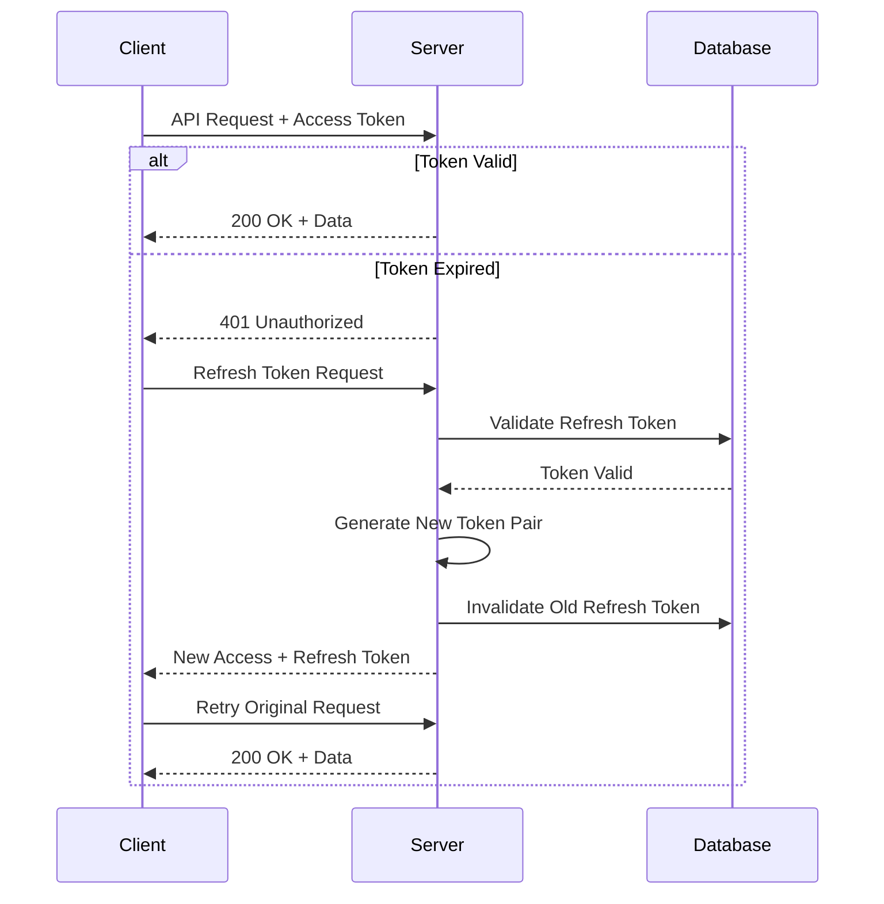

# 🔒 YanYu Cloud³ 安全实施指南

> **文档版本**: v2.0 | **最后更新**: 2026-05-01 | **安全评级**: A+

---

## 📋 目录

1. [安全架构概览](#1-安全架构概览)
2. [多层防护策略](#2-多层防护策略)
3. [JWT增强安全机制](#3-jwt增强安全机制)
4. [认证与授权](#4-认证与授权)
5. [数据保护](#5-数据保护)
6. [API安全](#6-api安全)
7. [基础设施安全](#7-基础设施安全)
8. [安全最佳实践](#8-安全最佳实践)
9. [漏洞报告流程](#9-漏洞报告流程)

---

## 1. 安全架构概览

### 安全设计原则

YanYu Cloud³ 采用**纵深防御**策略，实现多层次安全保护：

```
┌─────────────────────────────────────┐
│ 应用层安全 (HTTPS, CSP, CORS)        │ ← 第1层: 网络与应用
├─────────────────────────────────────┤
│ 认证授权 (JWT, RBAC, MFA)            │ ← 第2层: 身份验证
├─────────────────────────────────────┤
│ API安全 (签名, 限流, 加密)             │ ← 第3层: 接口保护
├─────────────────────────────────────┤
│ 数据安全 (加密存储, 传输加密)            │ ← 第4层: 数据保护
├─────────────────────────────────────┤
│ 基础设施 (防火墙, DDoS防护)            │ ← 第5层: 基础设施
└─────────────────────────────────────┘
```

---

## 2. 多层防护策略

### 2.1 应用层安全

#### HTTPS 强制使用
```typescript
// 生产环境强制 HTTPS
if (process.env.NODE_ENV === 'production') {
  app.use((req, res, next) => {
    if (req.protocol === 'https' || req.secure) {
      next();
    } else {
      res.redirect(301, `https://${req.headers.host}${req.url}`);
    }
  });
}
```

#### Content Security Policy (CSP)
```javascript
// Helmet CSP 配置
app.use(helmet({
  contentSecurityPolicy: {
    directives: {
      defaultSrc: ["'self'"],
      styleSrc: ["'self'", "'unsafe-inline'"],
      scriptSrc: ["'self'"],
      fontSrc: ["'self'", "data:"],
      imgSrc: ["'self'", "data:", "https:"],
    },
  },
}));
```

#### CORS 配置
```typescript
app.use(cors({
  origin: process.env.CORS_ORIGIN || 'http://localhost:3000',
  methods: ['GET', 'POST', 'PUT', 'DELETE', 'PATCH', 'OPTIONS'],
  allowedHeaders: ['Content-Type', 'Authorization'],
  credentials: true,
  maxAge: 86400, // 24小时预检缓存
}));
```

---

## 3. JWT 增强安全机制

### 3.1 Token 结构

**Access Token (短期 - 15分钟)**:
```typescript
interface AccessTokenPayload {
  sub: string;           // 用户ID
  email: string;         // 用户邮箱
  role: string;          // 角色
  permissions: string[]; // 权限列表
  deviceId: string;      // 设备指纹
  iat: number;           // 签发时间
  exp: number;           // 过期时间
  type: 'access';        // Token类型
}
```

**Refresh Token (长期 - 7天)**:
```typescript
interface RefreshTokenPayload {
  sub: string;        // 用户ID
  tokenId: string;    // 唯一Token ID（用于撤销）
  iat: number;        // 签发时间
  exp: number;        // 过期时间
  type: 'refresh';    // Token类型
}
```

### 3.2 Token 刷新流程



### 3.3 Token 存储安全

| 存储方式 | Access Token | Refresh Token |
|---------|-------------|---------------|
| 内存 (推荐) | ✅ | ❌ |
| HttpOnly Cookie | ✅ | ✅ |
| LocalStorage | ⚠️ XSS风险 | ❌ |
| SessionStorage | ⚠️ XSS风险 | ❌ |

---

## 4. 认证与授权

### 4.1 密码安全

```typescript
import bcrypt from 'bcrypt';

const SALT_ROUNDS = 12;

// 密码哈希
const hashPassword = async (password: string): Promise<string> => {
  return bcrypt.hash(password, SALT_ROUNDS);
};

// 密码验证
const verifyPassword = async (
  password: string, 
  hash: string
): Promise<boolean> => {
  return bcrypt.compare(password, hash);
};
```

### 4.2 RBAC 权限控制

```typescript
// 角色定义
enum UserRole {
  ADMIN = 'admin',
  MANAGER = 'manager',
  USER = 'user',
  GUEST = 'guest'
}

// 权限矩阵
const ROLE_PERMISSIONS: Record<UserRole, string[]> = {
  admin: ['*'], // 全部权限
  manager: [
    'ticket:read', 'ticket:write', 'ticket:delete',
    'reconciliation:read', 'reconciliation:write',
    'user:read'
  ],
  user: [
    'ticket:read', 'ticket:write',
    'reconciliation:read'
  ],
  guest: [
    'ticket:read'
  ]
};
```

### 4.3 中间件实现

```typescript
// 认证中间件
export const authenticate = async (
  req: AuthenticatedRequest,
  res: Response,
  next: NextFunction
): Promise<void> => {
  try {
    const token = extractBearerToken(req.headers.authorization);
    
    if (!token) {
      throw new AppError(ErrorCode.UNAUTHORIZED, 'Missing authentication token');
    }

    const payload = await verifyAccessToken(token);
    req.user = payload;
    next();
  } catch (error) {
    next(error);
  }
};

// 授权中间件
export const authorize = (...permissions: string[]) => {
  return (req: AuthenticatedRequest, res: Response, next: NextFunction): void => {
    const userPermissions = req.user?.permissions || [];
    
    const hasPermission = permissions.some(
      perm => userPermissions.includes(perm) || userPermissions.includes('*')
    );

    if (!hasPermission) {
      throw new AppError(ErrorCode.FORBIDDEN, 'Insufficient permissions');
    }
    
    next();
  };
};
```

---

## 5. 数据保护

### 5.1 敏感数据加密

```typescript
import crypto from 'crypto';

const ALGORITHM = 'aes-256-gcm';
const KEY_LENGTH = 32;
const IV_LENGTH = 16;
const TAG_LENGTH = 16;

// 加密敏感字段
const encryptField = (plaintext: string, key: string): string => {
  const iv = crypto.randomBytes(IV_LENGTH);
  const cipher = crypto.createCipheriv(ALGORITHM, Buffer.from(key), iv);
  
  let encrypted = cipher.update(plaintext, 'utf8', 'hex');
  encrypted += cipher.final('hex');
  
  const tag = cipher.getAuthTag();
  
  return `${iv.toString('hex')}:${tag.toString('hex')}:${encrypted}`;
};

// 解密
const decryptField = (encryptedData: string, key: string): string => {
  const [ivHex, tagHex, encrypted] = encryptedData.split(':');
  
  const decipher = crypto.createDecipheriv(
    ALGORITHM, 
    Buffer.from(key), 
    Buffer.from(ivHex, 'hex')
  );
  
  decipher.setAuthTag(Buffer.from(tagHex, 'hex'));
  
  let decrypted = decipher.update(encrypted, 'hex', 'utf8');
  decrypted += decipher.final('utf8');
  
  return decrypted;
};
```

### 5.2 数据库安全

```sql
-- 启用行级安全策略 (RLS)
ALTER TABLE tickets ENABLE ROW LEVEL SECURITY;

-- 创建策略：用户只能查看自己的工单
CREATE POLICY user_tickets ON tickets
  FOR ALL
  USING (created_by = current_user);

-- 加密敏感列
ALTER TABLE users ADD COLUMN encrypted_ssn text;

-- 创建触发器自动加密
CREATE OR REPLACE FUNCTION encrypt_sensitive_data()
RETURNS TRIGGER AS $$
BEGIN
  NEW.encrypted_ssn = pgp_symmetric_encrypt(
    NEW.ssn,
    current_setting('app.encryption_key')
  );
  NEW.ssn = NULL; -- 清除明文
  RETURN NEW;
END;
$$ LANGUAGE plpgsql;
```

---

## 6. API 安全

### 6.1 速率限制

```typescript
import rateLimit from 'express-rate-limit';

// 全局限流
const globalLimiter = rateLimit({
  windowMs: 15 * 60 * 1000, // 15分钟
  max: 100,                 // 每IP 100次请求
  standardHeaders: true,
  legacyHeaders: false,
  message: {
    error: 'Too many requests, please try again later.',
    retryAfter: Math.ceil(15 * 60 * 1000 / 1000),
  },
});

// 认证接口更严格限制
const authLimiter = rateLimit({
  windowMs: 15 * 60 * 1000,
  max: 5,                  // 登录接口每15分钟5次
  message: { error: 'Too many login attempts' },
});
```

### 6.2 输入验证

```typescript
import { body, validationResult } from 'express-validator';

// 工单创建验证规则
const createTicketValidation = [
  body('title')
    .trim()
    .isLength({ min: 3, max: 200 })
    .withMessage('Title must be 3-200 characters')
    .escape(),
  
  body('description')
    .optional()
    .trim()
    .isLength({ max: 5000 })
    .withMessage('Description too long')
    .sanitizeHtml(), // 防止XSS
  
  body('priority')
    .isIn(['low', 'medium', 'high', 'critical'])
    .withMessage('Invalid priority'),
  
  (req: Request, res: Response, next: NextFunction) => {
    const errors = validationResult(req);
    if (!errors.isEmpty()) {
      throw new AppError(
        ErrorCode.VALIDATION_ERROR, 
        'Validation failed',
        errors.array()
      );
    }
    next();
  },
];
```

### 6.3 SQL 注入防护

```typescript
// ✅ 正确：使用参数化查询
const getUserById = async (userId: string) => {
  const result = await pool.query(
    'SELECT * FROM users WHERE id = $1',
    [userId] // 参数化，防止SQL注入
  );
  return result.rows[0];
};

// ❌ 错误：字符串拼接（危险！）
// const query = `SELECT * FROM users WHERE id = '${userId}'`;
```

---

## 7. 基础设施安全

### 7.1 Docker 安全

```dockerfile
# 使用非root用户运行
FROM node:20-alpine

# 创建专用用户
RUN addgroup -S appgroup && adduser -S appuser -G appgroup

USER appuser

# 只读文件系统
VOLUME ["/app/tmp"]

# 移除不必要的工具
RUN apk del --purge \
    git \
    curl \
    wget
```

### 7.2 日志安全

```typescript
// 不要记录敏感信息
const sanitizeLogData = (data: Record<string, unknown>): Record<string, unknown> => {
  const sensitiveFields = [
    'password', 
    'token', 
    'apiKey', 
    'secret',
    'creditCard',
    'ssn'
  ];
  
  const sanitized = { ...data };
  
  for (const field of sensitiveFields) {
    if (sanitized[field]) {
      sanitized[field] = '[REDACTED]';
    }
  }
  
  return sanitized;
};
```

---

## 8. 安全最佳实践

### ✅ 必须遵守

1. **最小权限原则**
   - 数据库用户仅授予必要权限
   - API Token 限制作用域和有效期
   - 文件系统只读访问

2. **定期安全审计**
   ```bash
   # 每周运行安全扫描
   npm audit --production
   
   # 依赖漏洞检查
   npm outdated
   ```

3. **安全响应计划**
   - 建立 24/7 安全监控
   - 制定应急响应流程
   - 定期演练安全事件处理

### ❌ 绝对禁止

1. **硬编码密钥或密码**
2. **在日志中输出敏感信息**
3. **禁用生产环境的安全头**
4. **使用 `eval()` 或类似危险函数**
5. **忽略依赖安全警告**

---

## 9. 漏洞报告流程

### 如何报告安全漏洞

请通过以下方式报告安全漏洞：

1. **首选方式**: 发送电子邮件至 [security@yanyucloud.com](mailto:security@yanyucloud.com)
2. 请在主题中包含「**安全漏洞报告 - YanYu Cloud³**」

### 报告内容要求

为了帮助我们快速解决问题，请在报告中包含：

- ✅ 漏洞的详细描述
- ✅ 复现漏洞的步骤（PoC）
- ✅ 受影响的组件和版本号
- ✅ 可能的影响范围和严重程度评估
- ✅ 如有可能，提供修复建议

### 响应时间承诺

| 阶段 | 时间框架 | 说明 |
|------|---------|------|
| 确认收到 | 24小时内 | 确认报告已收到 |
| 初步评估 | 72小时内 | 提供初步严重性评估 |
| 进度更新 | 每周至少一次 | 更新修复进展 |
| 修复发布 | 根据严重程度 | 发布安全补丁 |
| 公开披露 | 修复后90天 | 发布安全公告 |

### 奖励计划

我们认可安全研究者的贡献：

- 🔴 **Critical**: $2,000 - $10,000
- 🟠 **High**: $1,000 - $5,000
- 🟡 **Medium**: $500 - $2,000
- 🟢 **Low**: $100 - $500
- ⚪ **Informational**: 荣誉证书 + 致谢

---

## 📊 安全检查清单

部署前必须完成以下检查：

- [ ] 所有环境变量已从代码中移除
- [ ] JWT 密钥强度 >= 256位
- [ ] HTTPS 已启用且配置正确
- [ ] CSP 头已配置
- [ ] 速率限制已启用
- [ ] 输入验证已实施
- [ ] SQL 注入防护已到位
- [ ] XSS 防护已启用
- [ ] CSRF 保护已配置
- [ ] 日志中无敏感信息
- [ ] 依赖项已更新到最新安全版本
- [ ] 数据库备份已加密
- [ ] 访问控制列表 (ACL) 已审查

---

**维护者**: YYC3 Security Team  
**联系方式**: security@yanyucloud.com  
**相关文档**: [SECURITY.md](../SECURITY.md) | [环境配置](ENVIRONMENT_CONFIG.md)